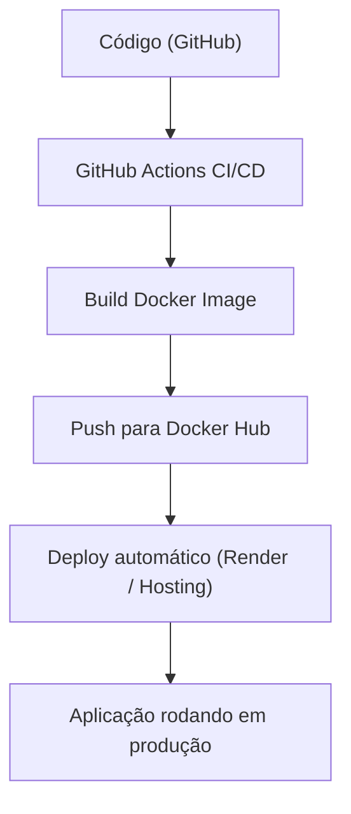

<!--# GCMS-Davi_Freitas
Repositorio para a disciplina de Gerenciamento Configuração e Testes - TADS - IFPE - 2025.2 - 4ºperiodo.

# Colaboradores
Coloque seu nome abaixo se você é um dos colaboradores do repositório:

* Davi Freitas (@DCF-2, dono)
* Ramide Dantas (@ramidedantas)-->

<!-- ====================== HEADER / BADGES ====================== -->
<div align="center">
  <h1>GCMS-Davi_Freitas</h1>
  <p>Aplicação Java containerizada com Docker + CI/CD + Deploy automático</p>

  <!-- Badges -->
  <p>
      
      
      
      
      
  </p>
</div>

---

## 📖 Sobre

`GCMS-Davi_Freitas` é uma aplicação Java desenvolvida como parte da disciplina **GCMS (Gerência de Configuração e Mudança de Software)**.  
O projeto demonstra uma configuração completa de **containerização com Docker**, **integração contínua (CI)** via GitHub Actions, e **deploy automatizado** — ideal para garantir padronização e portabilidade entre ambientes.

O sistema serve como um exemplo prático de boas práticas de DevOps + Java + Deploy contínuo, e pode ser usado como base para outros projetos acadêmicos ou profissionais.

---

## 🧰 Tecnologias e Ferramentas

- Java (versão compatível configurada no `build.gradle`)
- Docker (imagem base `debian:bookworm-slim`)
- Gradle (build e dependências)
- GitHub Actions (pipeline CI/CD)
- (Opcional) Registro de imagens no Docker Hub  
- (Opcional) Serviço de hospedagem externa para deploy automático  

---

## 🚀 Como usar / Rodar

> **Pré-requisito:** ter Docker instalado localmente ou usar a imagem já publicada no Docker Hub.  

1. Build da imagem Docker  
   ```bash
   docker build -t gcms-app .
   ```
## ▶️ Execução da aplicação com container
   ```bash
   docker run -p 8080:8080 gcms-app
   ```
2. Acesse no navegador:
```
http://localhost:8080
```
Se a imagem estiver publicada no Docker Hub, basta usar o comando docker run
apontando para ela, sem necessidade de build local.

## 📈 Fluxo / Arquitetura (Diagrama)
Aqui está um diagrama simplificado do fluxo do projeto — desde o build até o deploy:




## 🌐 Demo / Deploy
A versão em produção já está acessível publicamente — confira:
**URL do app:** _[WebApp](https://webapp-gcms-davi.onrender.com/)_

## 🧪 Automatização e Deploy Contínuo
O pipeline de CI/CD configurado contempla:
- Build dentro de container Docker
- Testes automatizados (quando aplicável)
- Push automático da imagem para Docker Hub
- (Opcional) Redeploy automático via Deploy Hook ao atualizar a imagem

Secrets utilizados no GitHub:
- DOCKERHUB_USERNAME
- DOCKERHUB_TOKEN
- RENDER_DEPLOY_HOOK

## 📁 Estrutura do Repositório
```bash
─ src/                  # Código fonte Java  
─ Dockerfile            # Definição da imagem Docker  
─ build.gradle          # Build e dependências  
─ .github/  
   └─ workflows/  
       └─ gradle.yml    # Pipeline CI/CD  
─ README.md             # Documentação do projeto
```
### 🤝 Colaboradores / Autor 
Coloque seu nome abaixo se você é um dos colaboradores do repositório:

* Davi Freitas (@DCF-2, dono)
* Ramide Dantas (@ramidedantas)-->

## 📝 Licença
Este projeto está licenciado sob a MIT License
Fique à vontade para usar, adaptar e contribuir.
